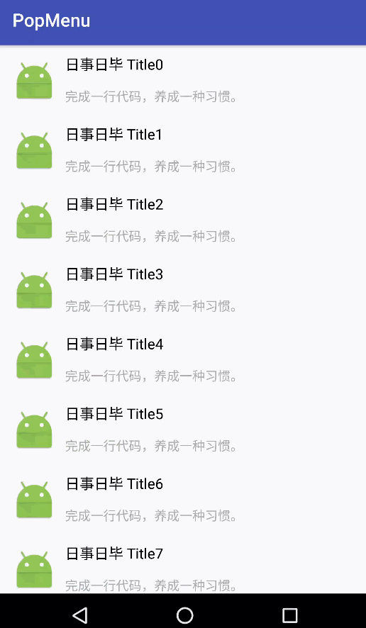

# PopMenu
popwindow anim

>增加一种 记事类应用 完成等点击展开选项的动画。



##使用

```
            PopMenu.Builder
                     .create(this)
                     .setItemView(view)
                     .setMenuView(optionView)
                     .setTextView(((ViewHolder)obj).titleView)
                     .build()
                     .show();
```

- **itemView** :  列表中普通的卡片，基于此卡片展开选项菜单
- **menuView** :  菜单View。用于提供选项操作
- **textView** :  画完成线。对于已完成任务，动画画出一条删除线